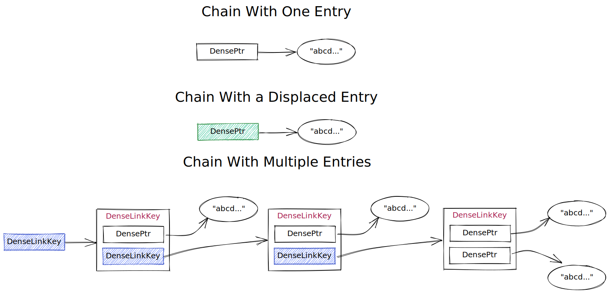

# DenseSet in Dragonfly

`DenseSet` uses [classic hashtable with separate chaining](https://en.wikipedia.org/wiki/Hash_table#Separate_chaining) similar to the Redis dictionary for lookup of items within the set.

The main optimization present in `DenseSet` is the ability for a pointer to **point to either an object or a link key**, removing the need to allocate a set entry for every entry. This is accomplished by using [pointer tagging](https://en.wikipedia.org/wiki/Tagged_pointer) exploiting the fact that the top 12 bits of any userspace address are not used and can be set to indicate if the current pointer points to nothing, a link key, or an object.

The following is what each bit in a pointer is used for

| Bit Index (from LSB) | Meaning |
| -------------------- |-------- |
|       0 - 52         | Memory address of data in the userspace |
|          53          | Indicates if this `DensePtr` points to data stored in the `DenseSet` or the next link in a chain |
|          54          | Displacement bit. Indicates if the current entry is in the correct list defined by the data's hash |
|          55          | Direction displaced, this only has meaning if the Displacement bit is set. 0 indicates the entry is to the left of its correct list, 1 indicates it is to the right of the correct list. |
|       56 - 63        | Unused |

Further, to reduce collisions items may be inserted into neighbors of the home chain (the chain determined by the hash) that are empty to reduce the number of unused spaces. These entries are then marked as displaced using pointer tagging.

An example of possible bucket configurations can be seen below.

 *Created using [excalidraw](https://excalidraw.com)*

### Insertion
To insert an entry a `DenseSet` will take the following steps:

1. Check if the entry already exists in the set, if so return false
2. If the entry does not exist look for an empty chain at the hash index ± 1, prioritizing the home chain. If an empty entry is found the item will be inserted and return true
3. If step 2 fails and the growth prerequisites are met, grow the number of chains in the set and repeat step 2
4. If step 3 fails, attempt to insert the entry in the home chain.
    - If the home chain is not occupied by a displaced entry insert the new entry in the front of the list
    - If the home chain is occupied by a displaced entry move the displaced entry to its home chain. This may cause a domino effect if the home chain of the displaced entry is occupied by a second displaced entry, resulting in up to `O(N)` "fixes"

### Searching
To find an entry in a `DenseSet`:

1. Check the first entry in the home and neighbour cells for matching entries
2. If step 1 fails iterate the home chain of the searched entry and check for equality

### Pending Improvements
Some further improvements to `DenseSet` include allowing entries to be inserted in their home chain without having to perform the current `O(N)` steps to fix displaced entries. By inserting an entry in their home chain after the displaced entry instead of fixing up displaced entries, searching incurs minimal added overhead and there is no domino effect in inserting a new entry. To move a displaced entry to its home chain eventually multiple heuristics may be implemented including:

- When an entry is erased if the chain becomes empty and there is a displaced entry in the neighbor chains move it to the now empty home chain
- If a displaced entry is found as a result of a search and is the root of a chain with multiple entries, the displaced node should be moved to its home bucket

## Benchmarks

At 100% utilization the Redis dictionary implementation uses approximately 32 bytes per record ([read the breakdown for more information](./dashtable.md#redis-dictionary))

In comparison using the neighbour cell optimization, `DenseSet` has ~21% of spaces unused at full utilization resulting in $N\*8 + 0.2\*16N \approx 11.2N$ or ~12 bytes per record, yielding ~20 byte savings. The number of bytes per record saved grows as utilization decreases.

Inserting 20M 10 byte strings into a set in chunks of 500 on an i5-8250U give the following results

|             | Dragonfly (DenseSet) | Dragonfly (Redis Dictionary) | Redis 7 |
|-------------|----------------------|------------------------------|---------|
| Time        |    44.1s             |            46.9s             |  50.3s  |
| Memory used |    626.44MiB         |            1.27G             |  1.27G  |